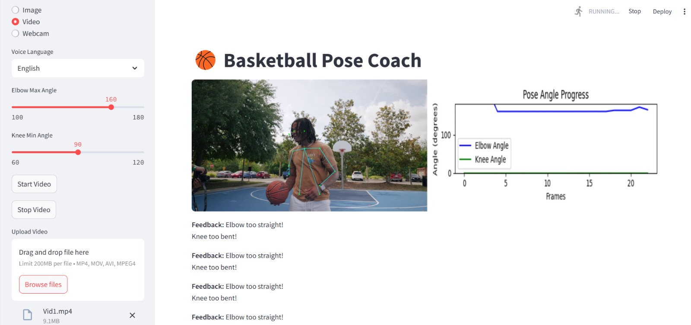
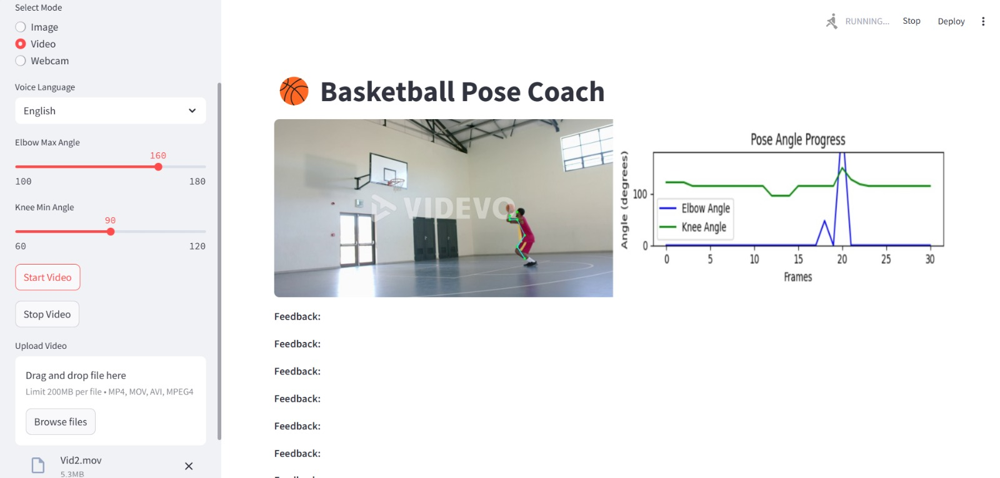
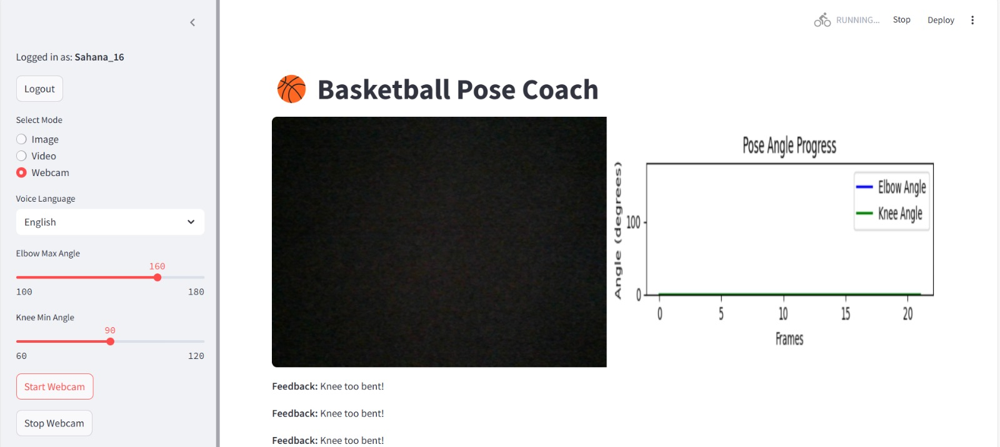

# SmartShot-Coach
AI-Based Shot Alignment Feedback

# 🏀 Basketball Pose Coach

A real-time AI-powered basketball shooting posture correction app using pose estimation. It provides visual and voice feedback, angle tracking, session score analysis, and downloadable performance CSVs. Built with OpenPose, OpenCV, and Streamlit.

---

## 🚀 Features

- 📸 Supports Image, Video, and Webcam modes
- 🦾 Real-time elbow and knee angle detection
- 📊 Angle progression plots over time
- 🔊 Multi-language voice feedback (English and Hindi)
- 📥 Downloadable session CSV reports
- 📦 Combined CSV report of all practice sessions
- 🔐 Login and performance tracking support (optional)

---

## 📷 Demo

| Mode        | Screenshot |
|-------------|------------|
| Image Mode  |  |
| Video Mode  |  |
| Webcam Mode |  |

---

## 🧠 Pose Estimation

This project uses OpenPose (can be extended to MediaPipe or custom models) to detect keypoints required to calculate:

- Elbow Angle
- Knee Angle

These angles are compared against configurable thresholds to provide performance feedback.

---

## 📦 Setup Instructions

### 🔧 Requirements

- Python 3.8+
- Streamlit
- OpenCV
- NumPy
- Pandas
- Matplotlib
- pyttsx3 (for voice feedback)

### ✅ Install Dependencies

```bash
pip install -r requirements.txt
